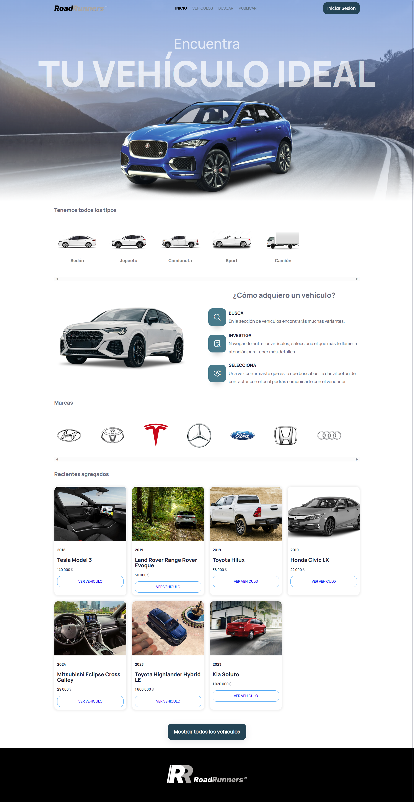
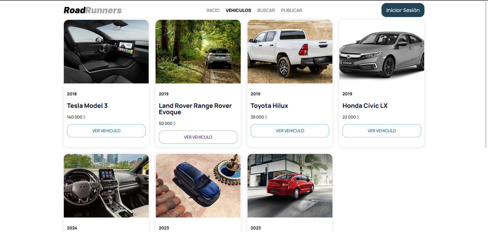
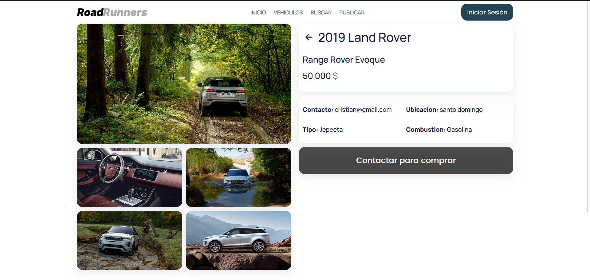
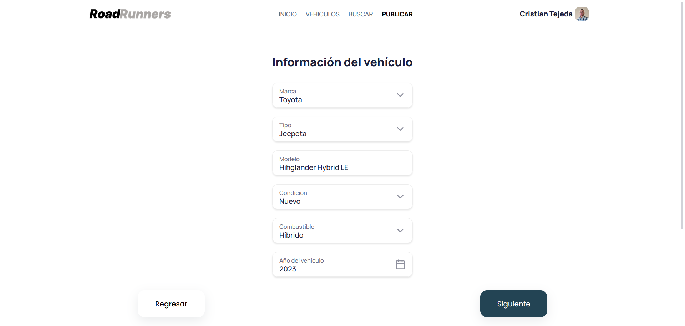
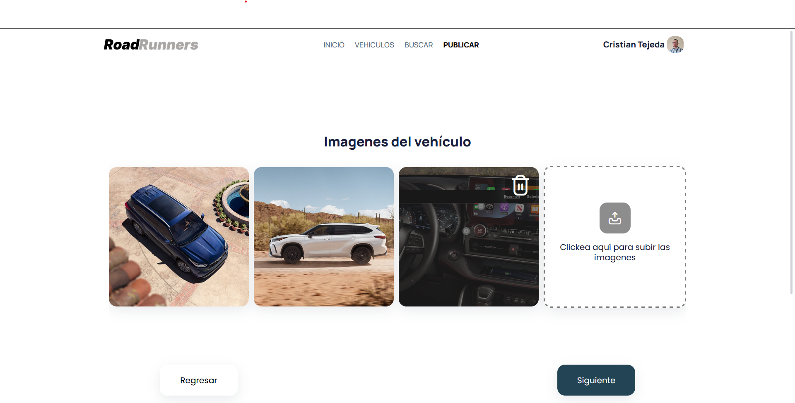
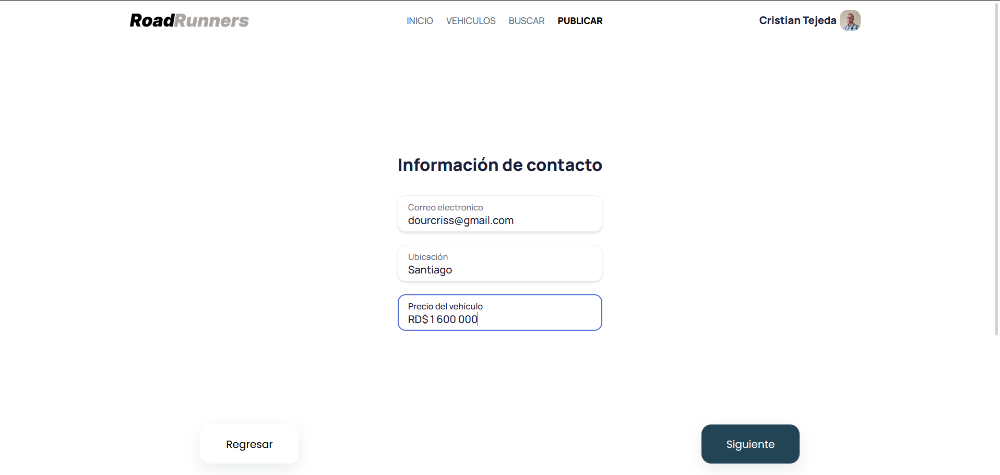

# RoadRunners

This a project to test my knowledge in Angular, just for learning, not a real project.

In the UI, I use Taiga UI, is UI kit that helps frontend developers with pre-built components for a better UI [Taiga UI Documentation](https://taiga-ui.dev/getting-started).

I made this project in collaboration with my partner [HaroldMart backend repository](https://github.com/HaroldMart/RoadRunners-Backend).

## Screenshots preview

### Home Screen

### Vehicles Screen

### Vehicle Details Screen

### Publishing a vehicle Screen

This project was generated with [Angular CLI](https://github.com/angular/angular-cli) version 15.2.4 and was updated to Angular 17.0.3.

## Development server

Run `ng serve` for a dev server. Navigate to `http://localhost:4200/`. The application will automatically reload if you change any of the source files.

## Code scaffolding

Run `ng generate component component-name` to generate a new component. You can also use `ng generate directive|pipe|service|class|guard|interface|enum|module`.

## Build

Run `ng build` to build the project. The build artifacts will be stored in the `dist/` directory.

## Running unit tests

Run `ng test` to execute the unit tests via [Karma](https://karma-runner.github.io).

## Running end-to-end tests

Run `ng e2e` to execute the end-to-end tests via a platform of your choice. To use this command, you need to first add a package that implements end-to-end testing capabilities.

